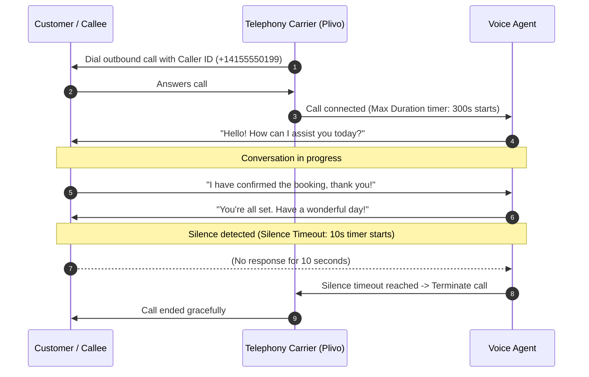

The **Call Tab** in Agent Studio controls call lifecycle limits, silence detection, telephony routing, and caller identification for voice interactions.

---

## Overview

| Field | Description |
|---|---|
| **Max Call Duration** | Maximum call duration, what happens when the limit is reached, and allowed range/unit |
| **Silence Timeout** | What counts as silence, when the timer starts, and what happens after timeout |
| **Telephony Provider** | Supported providers (Twilio, Plivo, Acefone) and how to configure/select them |
| **Caller ID** | Purpose, source of the number, requirements, and outbound-call behavior |
| **Integrations** | How telephony credentials and phone numbers are connected to the agent |
| **Configuration Example** | Example of a complete Call Tab configuration and expected call behavior |

---

## Max Call Duration

* **Maximum call duration:** Sets the maximum allowable runtime for any single call session handled by the agent.
* **Allowed range and unit:** Specified in **seconds** (e.g., `90` for 1.5 minutes, `300` for 5 minutes, `1800` for 30 minutes). Supported range is `10` to `3600` seconds (up to 60 minutes).
* **What happens when the limit is reached:** When the active call duration reaches this limit, the platform automatically and gracefully terminates the call.
* **Why it matters:** Protects against runaway calls, infinite loops, and unexpected billing charges from dropped caller connections.

---

## Silence Timeout

* **What counts as silence:** Any period during a call where the Voice Activity Detection (VAD) engine detects no human speech input. Ambient background noise is automatically filtered out.
* **When the timer starts:** The silence timer starts (and resets) immediately after the agent finishes speaking and is waiting for a response from the caller, or during pauses between caller conversational turns.
* **What happens after timeout:** If the caller remains silent for longer than the configured timeout, the agent automatically ends the call session to free the telephony channel.
* **Allowed range and unit:** Configured in **seconds** (supported range: `5` to `60` seconds; default is `10` seconds).

---

## Telephony Provider

* **Supported providers:**
  * **Twilio** — Global carrier connectivity and high reliability.
  * **Plivo** — Cost-effective voice routing, especially for India and APAC destinations.
  * **Acefone** — Enterprise cloud telephony and virtual PBX routing.
* **How to configure and select:**
  * **Tenant Default:** Automatically inherits the default telephony provider configured in your organization's [Integrations](/features/integrations).
  * **Explicit Selection:** Choose a specific provider from the dropdown to route calls for this particular agent through a dedicated account.

---

## Caller ID

* **Purpose:** The phone number presented as the caller identity (CLI) on the recipient's phone screen during outbound calls and automated campaigns.
* **Source of the number:** Sourced from verified numbers purchased or registered under the [Phone Numbers](/guides/numbers/purchase-phone-numbers) section.
* **Requirements:**
  * Must be a valid phone number in standard E.164 format (e.g., `+14155552671` or `+919876543210`).
  * Must be verified or owned under your connected telephony carrier account (see [Caller ID Verification](/guides/numbers/caller-id-verification)).
* **Outbound-call behavior:** The carrier transmits this number in SIP signaling headers, displaying it to the callee. Inbound calls returning to this number route directly to the assigned agent.

---

## Integrations

How telephony credentials and phone numbers are connected to the agent:

<Steps>
  <Step title="Connect Provider Credentials">
    Go to **Integrations** in the dashboard and add your telephony credentials (e.g., Twilio Account SID and Auth Token, or Plivo Auth ID and Auth Token). Credentials are automatically validated upon saving.
  </Step>
  <Step title="Add and Verify Phone Numbers">
    Go to **Phone Numbers** to buy numbers directly through your connected carrier or verify existing company numbers for outbound Caller ID use.
  </Step>
  <Step title="Bind to Agent in Call Tab">
    Open your agent in **Agent Studio**, switch to the **Call Tab**, and choose the **Telephony Provider** and verified **Caller ID**. Save your changes.
  </Step>
</Steps>

---

## Configuration Example

### Complete Call Tab Configuration

Below is an example of a complete Call Tab configuration:

```yaml
# Agent Studio - Call Tab Settings
max_call_duration: 300       # 5 minutes maximum call duration
silence_timeout: 10          # 10 seconds silence timeout
telephony_provider: "Plivo"  # Route through Plivo
caller_id: "+14155550199"    # Verified company caller ID
```

### Expected Call Behavior



* **Outbound Caller Display:** The callee sees `+14155550199` on their incoming call screen.
* **Silence Handling:** If the conversation ends and the callee doesn't hang up, the agent waits `10 seconds` of silence before automatically hanging up.
* **Duration Limit:** If the call exceeds `300 seconds` (5 minutes), the session is terminated automatically to prevent open-line billing.
