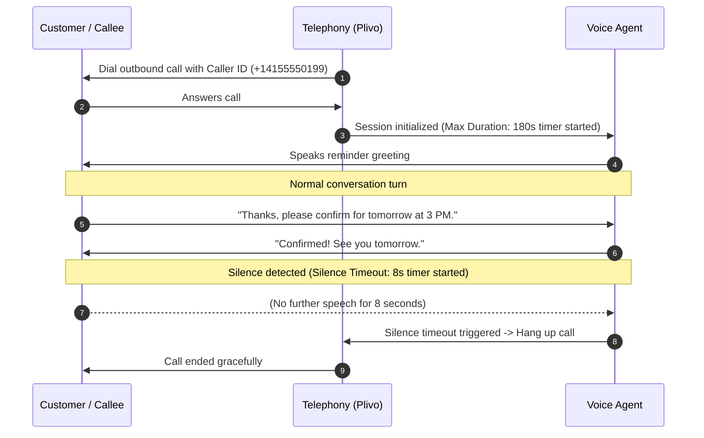

The **Call Tab** in Agent Studio controls the runtime lifecycle, safety limits, and telephony routing for all phone and voice interactions handled by your agent.

---

## Settings Overview

| Field | Description | Default | Allowed Range / Options |
|---|---|---|---|
| **Max Call Duration** | Maximum time a call can run before automatic termination | `90` seconds | `10` – `3600` seconds (up to 60 mins) |
| **Silence Timeout** | Duration of caller silence before the agent hangs up | `10` seconds | `5` – `60` seconds |
| **Telephony Provider** | Telecommunications carrier used for call routing | `Tenant default` | `Tenant default`, `Twilio`, `Plivo`, `Acefone` |
| **Caller ID** | Outbound phone number displayed to the callee | `—` (Unset) | Any verified number from **Phone Numbers** |

---

## Detailed Field Specifications

### Max Call Duration

* **Description:** Sets a hard ceiling on the total duration of an active call session.
* **Allowed Range & Unit:** Specified in **seconds** (e.g., `90` for 1.5 minutes, `300` for 5 minutes, `1800` for 30 minutes). Allowed range is `10` to `3600` seconds.
* **Behavior when Limit is Reached:** When the limit is reached, the platform automatically and gracefully terminates the call session.
* **Why it matters:** Prevents runaway calls caused by stuck conversations, background audio loops, or forgotten connections, protecting your wallet balance from excessive telecom and LLM charges.

### Silence Timeout

* **Description:** Defines the maximum continuous period of silence tolerated from the caller before the agent concludes that the caller is no longer responsive and ends the call.
* **What Counts as Silence:** Periods where the platform's Voice Activity Detection (VAD) detects no audible human speech. Non-speech background ambient noise is automatically filtered out.
* **When the Timer Starts:** The silence timer starts (and resets) each time the agent finishes speaking and is awaiting a response from the caller, or during sustained mid-conversation pauses.
* **Behavior After Timeout:** Once caller silence exceeds the configured duration, the agent automatically hangs up the call to release telephony lines and prevent idle billing charges.
* **Allowed Range & Unit:** Specified in **seconds**, typically between `5` and `60` seconds (default: `10` seconds).

### Telephony Provider

* **Description:** Specifies the telephony carrier used to initiate outbound calls and receive inbound calls for this agent.
* **Supported Providers:** 
  * `Twilio` — Global reach and carrier-grade reliability.
  * `Plivo` — Cost-effective voice routing, highly recommended for India and APAC traffic.
  * `Acefone` — Enterprise VoIP and specialized virtual PBX routing.
* **How to Configure & Select:**
  * **Tenant Default:** Inherits the primary telephony provider configured in your organization's [Integrations](/features/integrations) settings.
  * **Dedicated Selection:** Select an explicit provider from the dropdown to route this specific agent's traffic through a dedicated provider account.
* **Prerequisites:** You must have connected and verified your provider API credentials under **Integrations** before selecting them.

### Caller ID

* **Description:** The phone number presented as the caller identity (CLI) on the recipient's phone screen when the agent places outbound calls or executes voice campaigns.
* **Source of the Number:** Numbers registered, verified, or purchased under the [Phone Numbers](/guides/numbers/purchase-phone-numbers) section.
* **Requirements:**
  * Must be a valid, active number in standard E.164 format (e.g., `+14155552671` or `+919876543210`).
  * Must be purchased through or verified with your selected telephony provider (see [Caller ID Verification](/guides/numbers/caller-id-verification)).
* **Outbound-Call Behavior:** Carrier signaling transmits this number in the SIP headers. When the recipient receives the call, this number is displayed on their screen. Inbound calls to this number can also be routed back to this agent.

---

## Telephony Integrations & Number Setup

To connect telephony credentials and assign phone numbers to your agent:

<Steps>
  <Step title="Connect Telephony Provider">
    Navigate to **Integrations** in the platform dashboard. Add your provider credentials (such as Twilio Account SID/Auth Token or Plivo Auth ID/Auth Token). Credentials are automatically validated upon saving.
  </Step>
  <Step title="Acquire or Verify Phone Numbers">
    Go to **Phone Numbers** to purchase dedicated local, toll-free, or 140/160 series numbers directly through your connected carrier, or verify existing numbers for outbound Caller ID use.
  </Step>
  <Step title="Assign to Agent in Call Tab">
    Open your agent in **Agent Studio**, click the **Call Tab**, and choose your desired **Telephony Provider** and verified **Caller ID**. Click **Save** to apply the configuration.
  </Step>
</Steps>

---

## Configuration Example & Expected Behavior

### Example: Outbound Appointment Reminder Agent

Here is a typical production configuration for an outbound reminder agent:

```yaml
# Agent Studio - Call Tab Settings
max_call_duration: 180       # 3 minutes
silence_timeout: 8           # 8 seconds
telephony_provider: "Plivo"  # Route through Plivo APAC
caller_id: "+14155550199"    # Verified company outbound line
```

### Expected Call Behavior:



* **Outbound Identification:** The recipient's phone displays `+14155550199` as the incoming caller.
* **Duration Safeguard:** If the call is still active at `180` seconds (3 minutes), the system automatically ends the call to prevent excessive duration.
* **Silence Handling:** If the customer finishes their response and remains silent for `8` seconds without hanging up, the silence timeout triggers and closes the connection cleanly.
