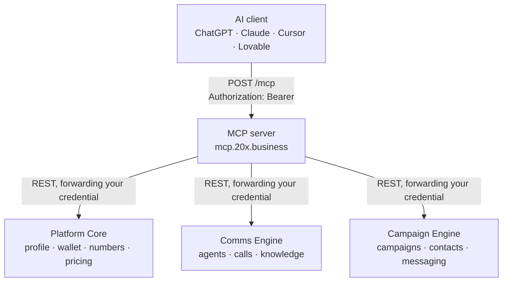

The MCP server is a thin translation layer. It speaks the Model Context Protocol to
your AI client, and plain REST to the same 20X APIs documented in the
[API Reference](/api-reference/introduction). It owns no database and stores nothing.

## The path a request takes



Each tool wraps exactly one REST endpoint. There is no business logic in the MCP
server, which means a tool cannot behave differently from the equivalent API call.

## It has no authority of its own

The credential your client sends is the credential used downstream. The server does
not hold a privileged service token and does not act on its own behalf.

The consequence is the useful part: **the MCP server cannot read or change anything
you could not already reach yourself** with the same credential against the public
API. Every tenant, role and permission check in the upstream services stays in
force, unchanged.

A service token here would have inverted that — broad rights, driven by a language
model.

Your credential is never stored. It lives for the duration of one request, is
forwarded on the downstream call, and is dropped when the request ends. Logs redact
anything matching a key pattern as a backstop.

## One account, fixed by the credential

Every call is bound to the account on the validated credential. **No tool accepts an
account, tenant or organisation identifier** — not at the top level, not nested
inside an object. There is no field in which an assistant could express "act on a
different account", so it cannot, whatever it is prompted to do.

Each request also builds its own server instance with your account captured inside
it, torn down when the request finishes. There is no shared mutable state in which
one account's context could be observed while handling another's request.

## Responses are filtered, not forwarded

Upstream responses are projected through an allow-list before they reach your
client. Anything not explicitly listed is dropped, so a sensitive field added
upstream later is excluded by default rather than leaking on the next deploy.

Never reaches an AI client, regardless of permissions:

- Wallet balance inside analytics responses, and per-call cost in call logs
- Call recording URLs
- Agent webhook tokens and signing secrets
- Integration credentials and provider balances

`get_wallet_balance` is the one exception, and only because you granted
`wallet:read` — and it returns the balance and currency, nothing else.

Filtering also keeps responses small enough to be useful. A raw upstream page would
consume a large share of the model's context for one call, so list tools cap at 25
items per page.

## Signing in

The endpoint is an OAuth 2.1 protected resource. Your client discovers where to sign
in on its own: it reads the server's metadata, which points at the 20X authorization
server, and sends you there. That is why pasting one URL is enough, with no issuer
address to configure.

Details worth knowing:

- Access tokens are accepted in the `Authorization` header only. The MCP
  authorization spec prohibits tokens in a query string, and the server does not
  read them from anywhere else.
- PKCE is required, `S256` only.
- A token from this flow is marked as such, and is refused on any route that has not
  explicitly declared which permission it needs. Since no permission exists for
  billing, credentials, keys or user management, those routes are unreachable by an
  assistant by construction rather than by a rule someone has to remember.

Integration keys are the alternative for clients with no
browser, and are checked the same way.

## Transport

Streamable HTTP, stateless, with plain JSON responses. One endpoint handles
everything:

```
POST https://mcp.20x.business/mcp
```

No tool streams partial output, so every result comes back on the POST that asked
for it. A `GET` to the endpoint returns `405` deliberately — the server never pushes
unsolicited messages, and a held-open stream that never carries anything is a
connection leak rather than a feature. See
[Limits & Errors](/mcp/limits-and-errors) for the detail.

Being stateless follows from authentication. The credential arrives on each request
and the account is baked into that request's tools. Reusing a server across requests
would mean either re-binding that context on a live instance or keeping a session map
— both of which put one account's context one bug away from another's. Building per
request removes the failure mode instead of guarding against it.

<CardGroup cols={2}>
  <Card title="Permissions" href="/mcp/permissions" icon="shield-check">
    What you can grant, and what is never grantable.
  </Card>
  <Card title="Limits & Errors" href="/mcp/limits-and-errors" icon="gauge">
    Rate limits, page sizes and error codes.
  </Card>
</CardGroup>
